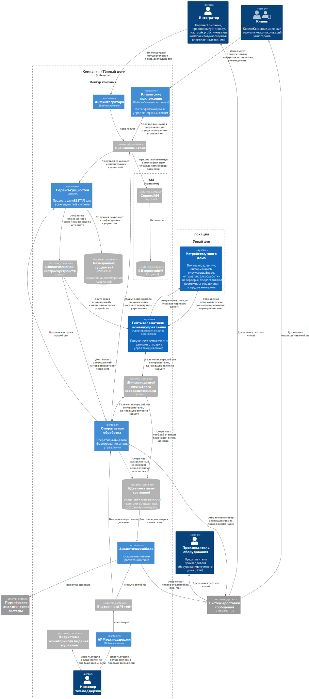
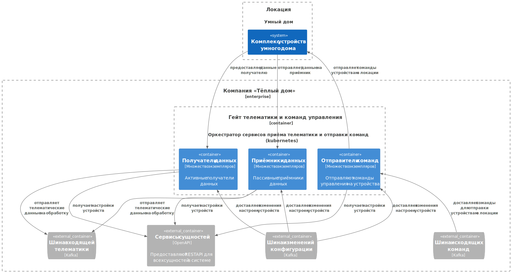

# Задание 1. Анализ и планирование

Ниже приведен анализ программного комплекса, осуществляющего мониторинг и управление отоплением домовладений.

### 1. Описание функциональности монолитного приложения

В настоящее время приложение предоставляет следующие функции:

**Управление отоплением:**

* Пользователи могут задать желаемую температуру в устройстве обогрева [(прим. 1)](#примечание-1).
* Пользователи могут включить устройство обогрева [(прим. 1)](#примечание-1).
* Пользователи могут выключить устройство обогрева[(прим. 1)](#примечание-1).

**Мониторинг температуры:**

* Пользователи могут запросить последнее переданное на сервер значение температуры [(прим. 2)](#примечание-2).
* Пользователи могут запросить последнее переданное на сервер состояние устройства: включено или нет, заданная и
  актуальная температура.
* Система поддерживает прием показателей актуальной температуры для указанного устройства
* Система поддерживает прием актуального состояния для указанного устройства

#### Примечание 1

Вопреки утверждению о том, что данные о температуре получаются через запрос от сервера к датчику, представленная версия
сервиса получает данные через запрос к серверу по REST API. Сервер сохраняет полученные данные: текущую и желаемую
температуры, состояние включения, — в реляционную БД.
Эта версия сервиса не осуществляет какого-либо управления конечным устройством (реализацию помечена к TODO).

#### Примечание 2
Предоставленная версия программы не накапливает историю переданных значений. 

В приложении имеется наивное определение репозитория для накопления данных о температуре, но полностью отсутствует
взаимодействие с этим репозиторием со стороны сервиса и контроллера. То есть, фактически этого функционала нет.

### 2. Анализ архитектуры монолитного приложения

* Язык программирования: Java
* База данных: PostgreSQL
* Архитектура: Монолитная, все компоненты системы (обработка запросов, бизнес-логика, работа с данными) находятся в
  рамках одного приложения.
* Взаимодействие: Синхронное, запросы обрабатываются последовательно.
* Масштабируемость: Ограничена, так как монолит сложно масштабировать по частям.
* Развёртывание: Требует остановки всего приложения.
* Степень проработки приложения низкая, количество накопленного кода минимальное. В репозитории представлен, в лучшем
  случае, MVP.

### 3. Определение доменов и ограниченных контекстов (bounded context)

Из описания существующей экосистемы можно выделить следующие домены и поддомены:

* Работа с пользователями системы:
  * Управление учётными записями и аутентификацией пользователей-клиентов системы [(прим. 3)](#примечание-3).
    Контексты:
      * каталог учётных записей.
      * подсистема или подсистемы аутентификации. 
      * подсистема восстановления утраченных креденшиалов.
  * Управление пользовательскими профилями [(прим. 3)](#примечание-3).
    Контексты:
      * каталог пользовательских профилей.
      * подсистема подтверждения контактных данных.
* Регистрация в системе и настройка новых температурных датчиков [(прим. 3)](#примечание-3).
  * Управление локациями: домов, квартир и т.п.
    Контекст:
      * каталог локаций, на которых идёт сбор телеметрии.
  * Подключение и настройка датчиков и систем контроля и управления.
    Контексты [(прим. 4)](#примечание-4):
      * подсистема настроек датчиков
      * подсистема настроек систем контроля и управления.
* Получение и обработка данных с датчиков температуры:
  * Получение данных с датчиков.
    Контекст или контексты:
      * подсистема получения данных с активных датчиков [(прим. 1)](#примечание-1) [(прим. 3)](#примечание-3).
      * подсистема опроса опроса пассивных датчиков [(прим. 1)](#примечание-1) [(прим. 3)](#примечание-3).
  * Накопление данных.
    Контекст:
      * подсистема сохранения показателей и ведения истории показаний.
  * Визуализация показателей температуры пользователю.
    Контексты:
      * подсистема визуализации текущих показателей
* Управление системой отопления [(прим. 3)](#примечание-3).
  * Ручное управление системой отопления
    Контекст:
      * подсистема включения/выключения отопления
  * Автоматизированное управление системой отопления
    Контекст:
      * подсистема задания целевой температуры

Планируемый функционал включает в себя следующие домены и поддомены:

* Работа с пользователями системы:
  * Управление ролями и правами пользователей всех типов
    Контексты:
      * каталог ролей
      * каталог прав пользователей
  * АРМ сотрудников клиентской поддержки [(прим. 5)](#примечание-5).
    Контекст:
      * подсистема обработки запросов на поддержку
  * АРМ партнёров-поставщиков оборудования [(прим. 6)](#примечание-6).
    Контекст:
      * подсистема доступа отчётов о работе оборудования [(прим. 7)](#примечание-7)
  * [Вероятно*](#примечание-8), АРМ партнёров-интеграторов.
    Контекст:
      * подсистема оповещений о неисправностях оборудования
      * подсистема доступа к отчётам интегратора [(прим. 7)](#примечание-7)
      * портал с базой знаний
* Приём и обработка входящих данных и управление различными типами датчиков и систем управления «умного дома»:
  * Сбор данных с устройств в локации для передачи на серверы Компании [(прим. 9)](#примечание-9)
    Возможный контекст:
      * Подсистема-хаб для сбора информации в локации и передаче её на серверы Компании
  * Приём данных из разных источников на серверах Компании [(прим. 10)](#примечание-10)
    Контексты:
      * модульная подсистема приёма данных различных типов
      * подсистема управления приёмниками данных [(прим. 11)](#примечание-11)
      * подсистема калибровочных таблиц и выражений пересчёта для входящих данных
  * Управление различными типами устройств [(прим. 10)](#примечание-10)
    Контексты:
      * подсистема настройки пользовательских команд для систем управления «умного дома»
      * модульная подсистема отправки команд различных типов
* Аналитика и отчёты
  * Построение отчётов
    Возможные контексты:
      * подсистема построения отчётов
      * конструктор отчётов
      * подсистема формирования отчётов по расписанию
  * Работа с оперативной аналитикой 
    Возможный контекст:
      * подсистема оперативной аналитики [(прим. 12)](#примечание-12)
  * Экспорт данных во внешние системы
    Контекст:
      * Внешние адаптеры по доступу к накопленным массивам данных для сторонних аналитических модулей. [(прим. 13)](#примечание-13)
* Финансовый блок [(прим. 14)](#примечание-14)
  Возможные контексты:
    * подсистема доступа к финансово-значимым отчётам
* Мониторинг и логгирование
  * Мониторинг
    Контексты:
    * подсистема сбора мониторинговой информации
    * подсистема визуализации мониторинговой информации
    * подсистема тревожных оповещений
  * Логгирование
    Контексты:
    * подсистема централизованного сбора и хранения журналов
    * подсистема оперативного мониторинга для журналов

#### Примечание 3

В настоящее время полностью отсутствует в приложении.

#### Примечание 4

Я не слишком хорошо знаком с предметной областью, но в смежных областях (мониторинг и управление транспортом)
получение данных и управление удаленными устройствами может реализовываться совершенно независимо, иногда даже
с использованием различных каналов связи: например, мониторинг передаёт данные по GPRS/3G, а управление устройством
идёт по SMS.

Поэтому я разделил контекст подключения и настройки датчиков и контекст подключения и настройки систем контроля и
управления.

#### Примечание 5

Напрямую о наличии выделенных сотрудников тех.поддержки и специализированного АРМа для них не говорится, но без них,
очевидно, бизнес не будет успешен.

#### Примечание 6

Опыт в смежной сфере показывает, что производители оборудования хотели бы получать обезличенную статистику
использования своих устройств.

Однако, этот поддомен практически не проработан, т.к. не хватает готовых знаний и
входных данных.

#### Примечание 7

Отчёты различных типов целесообразно поддерживать в модульной подсистеме построения отчётов. Однако, разные типы
пользователей системы, например, производители оборудования или интеграторы должны иметь доступ к специфическим
типам отчётов. В этих отчётах, предположительно, будет фигурировать информация не для всеобщего обозрения. 
Такие типы отчётов разумно предоставлять через особые фасады или даже полноценные микросервисы,
построенные на общей для всей отчётной подсистеме кодовой базе.

#### Примечание 8

Напрямую о наличии интеграторов не говорится, но учитывая географически распределенный характер бизнеса и
необходимость специальных знаний для организации умного дома, наличие региональных партнёров, обладающих необходимыми
компетенциями, неизбежно.

Однако, этот поддомен практически не проработан, т.к. не хватает готовых знаний и входных данных.

#### Примечание 9

Большинство устройств умного дома не подключаются напрямую в сеть Интернет. Вместо этого они используют протоколы
Bluetooth, BLE, Zigbee или какие-то вендор-специфичные протоколы для передачи данных на устройство-хаб,
которое уже занимается передачей данных по сетям TCP/IP.

Большинство производителей хабов, вполне предсказуемо, не позволяют настроить передачу данных с устройства на
произвольно выбранный сервер, принуждая пользователей использовать их экосистему для сбора и обработки данных.
Подключение и управление такими устройствами вне созданной производителем экосистемы возможно (например,
[подключение пылесосов Roborock к HomeAssistant](https://www.home-assistant.io/integrations/roborock/)), но зачастую
связано с "хакерской" деятельностью, например, подменой прошивок, перехватом сетевого трафика и другими действиями,
выходящими за пределы компетенций "обычного пользователя".

Поэтому для активного развития экосистемы умного дома Компании неизбежно понадобится свое собственное устройство (OEM),
используемое в качестве хаба либо небольшой набор поддерживаемых типов хабов.

#### Примечание 10

В состав умного дома может входить большой спектр устройств. Часть из них, как сказано выше, не имеют подключения к
сетям TCP/IP, используя устройства-хабы для передачи данных на центральный сервер. Другие же подключаются напрямую в
сеть, например, в сеть Wi-Fi, и передают данные на централизованный сервер, используя какие-либо протоколы уровня
приложения. Для получения и обработки данных, переданных по этим протоколам, понадобятся специфические сервисы,
каждый из которых умеет работать с одним или несколькими протоколами.

Аналогично, для отправки управляющих команд необходимо развернуть подсистему, которая будет доставлять эти команды
до устройств. В [примечании 4](примечание-4) отмечено, что в некоторых ситуациях приём данных и отправка команд
будет осуществляться разными подсистемами.

#### Примечание 11

По мере увеличения количества устройств, отправляющих данные, и увеличения типов поддерживаемых устройств возникает
потребность масштабировать и внешний контур приема данных:
  1. размещать приёмники на нескольких площадках различных площадках (аналог CDN, но наоборот)
  2. динамически балансировать нагрузку через запуск дополнительных экземпляров приемников и автоматическую
    маршрутизацию данных к ним
  3. ...

Эти меры потребуют выделения подсистемы управления приёмниками и описываются в особом контексте. Контекст
нуждается в дополнительной проработке.

#### Примечание 12

Пока нет понимания потенциальных объёмов входящих данных, но при значительном росте нагрузки и появлении
mission-critical задач (например, обработке сигналов от пожарной сигнализации) целесообразно физически разделять
оперативный контур и контур аналитики, даже если это онлайн-аналитика.

В любом случае, эту часть отчётной подсистемы необходимо проектировать более аккуратно.

#### Примечание 13

Для того, чтобы внешние системы могли эффективно применять методы анализа больших данных, необходимы специализированные
методы доступа к данным:
* данные должны быть обезличены
* должно предоставляться специализированное API c высокой степенью кастомизируемости запросов, например, какой-то
  вариант query language

Данный контекст нуждается в проработке.

#### Примечание 14

Даже если приложение не будет напрямую заниматься финансовыми вопросами, требуется готовить и выгружать отчёты по
финансово значимой деятельности.

Состав и другие характеристики отчётов необходимо прорабатывать дополнительно.

### **4. Проблемы нынешнего (монолитного) решения**

* Низкая степень проработки решения.
  Не проработаны вовсе такие важные аспекты, как безопасность данных, не внедрены аутентификация и ролевая модель,
  не проработан механизм регистрации (настройки) новых устройств.
* Монолитная система будет вызывать функциональные ограничения.
  Прикладная область весьма гетерогенна. В ней по самой природе присутствует большое количество автономных агентов,
  как акторов-людей, так и технологических устройств различных типов и различного предназначения. Монолитное решение
  будет препятствием для динамичного развития проекта, т.к. понадобится реализовывать разнородный и внутренне
  малосвязанный функционал (разного рода протоколы обмена данных с утройствами, функциональные модули, не зависящие
  друг от друга) в рамках одного громадного приложения.
* Монолитная система будет вызывать технологические ограничения.
  При росте нагрузки различные части системы понадобится масштабировать в разной степени, и разными методами,
  включая геораспределенное масштабирование. Монолитные системы плохо приспособлены для подобных подходов.
* Синхронное API плохо соответствует предметной области, в которой большинство взаимодействий конечных устройств 
  асинхронное. Синхронное API будет вызывать проблемы с производительностью при росте нагрузки.

### 5. Визуализация контекста системы — диаграмма С4

# Задание 2. Проектирование микросервисной архитектуры

**Диаграмма контейнеров (Containers)**

Контейнеры бэкенда (кроме гейта телематики)

Контейнеры гейта телематики

Устройства умного дома

**Диаграмма компонентов (Components)**

Компоненты контроллеров сущностей

Компоненты приёмника в гейте телематики

Компоненты приёмника в гейте телематики

Компоненты сервиса оперативной обработки

**Диаграмма кода (Code)**

# Задание 3. Разработка ER-диаграммы

Четвёртое задание — дополнительное. Его можно сделать по желанию. Чтобы ревьюер быстрее проверил ваше решение, укажите, сделали вы это задание или нет. Для этого оставьте нужный эмодзи около заголовка задания:

✅ — вы выполнили задание.

❌ — вы пропустили задание.

# ❌ Задание 4. Создание и документирование API

### 1. Тип API

Для получения данных о конфигурации устройств — синхронный API (OpenAPI). При отсутствии конфигурации дальнейшее выполнение
функции невозможно, поэтому с задержками при запросе через синхронный API придётся смириться. Недоступность сервиса конфигураций
компенсируется компонентой conf_keeper, сохраняющей последние известные значения в памяти процесса. Реализация синхронной логики
проще, чем асинхронной.

Оповещения об изменении конфигурации — асинхронный API (AsyncAPI, Kafka topic). Асинхронный API — классическое применение для
модели "один источник информации — много потребителей".

Передача телематических данных — асинхронный API  (AsyncAPI, Kafka topic)

### 2. Документация API

Здесь приложите ссылки на документацию API для микросервисов, которые вы спроектировали в первой части проектной работы. Для документирования используйте Swagger/OpenAPI или AsyncAPI.
